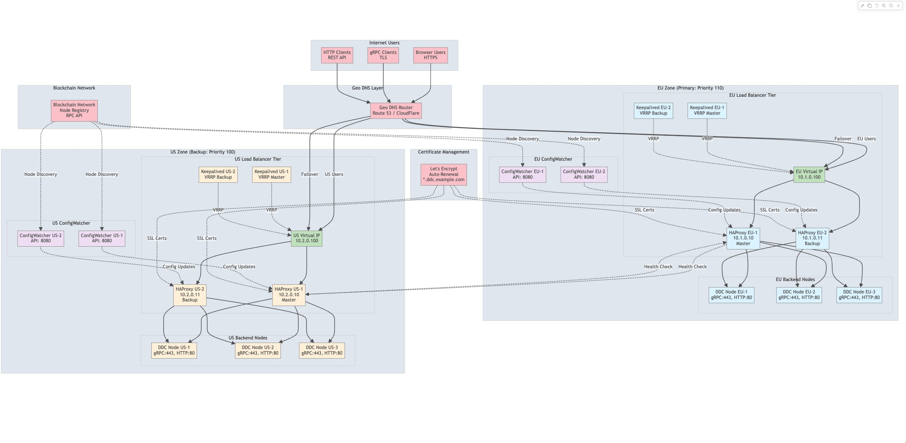

# DDC HAProxy Infrastructure

## 🚀 Overview

This project implements a **Decentralized Data Cloud (DDC) HAProxy Infrastructure** with multi-zone deployment, high availability, and dynamic configuration management. The infrastructure supports both EU and US zones with cross-zone failover, ConfigWatcher API integration, and zero-downtime reloads.

## 📋 Table of Contents

- [Features](#-features)
- [Architecture](#-architecture)
- [Quick Start](#-quick-start)
- [Deployment Guide](#-deployment-guide)
- [API Documentation](#-api-documentation)
- [Testing](#-testing)
- [Troubleshooting](#-troubleshooting)
- [Production Deployment](#-production-deployment)

## ✨ Features

### Core Infrastructure
- ✅ **Multi-Zone Deployment**: EU and US zones with independent HAProxy clusters
- ✅ **High Availability**: Keepalived VIP management with Active-Active HAProxy
- ✅ **Cross-Zone Failover**: Automatic failover between geographical zones
- ✅ **Zero-Downtime Reloads**: Configuration updates without service interruption
- ✅ **Geo DNS Routing**: Geographic traffic distribution

### ConfigWatcher Integration
- ✅ **Dynamic Configuration**: Real-time HAProxy config updates via API
- ✅ **Blockchain Integration**: DDC node discovery from blockchain
- ✅ **Container Management**: Dynamic Docker container creation/removal
- ✅ **REST API**: Comprehensive management interface
- ✅ **Authentication**: JWT-based API security

### Protocol Support
- ✅ **HTTP/HTTPS**: Web traffic with SSL termination
- ✅ **gRPC**: High-performance RPC protocol support
- ✅ **Health Checks**: Comprehensive backend monitoring
- ✅ **Statistics**: Real-time metrics and monitoring

### Security & Monitoring
- ✅ **TLS Encryption**: SSL/TLS for all external communications
- ✅ **Access Control**: Role-based authentication
- ✅ **Monitoring**: Prometheus metrics and Grafana dashboards
- ✅ **Logging**: Centralized logging with structured output

## 🏗️ Architecture

### System Architecture Diagram



### Component Overview

| Component | Purpose | High Availability |
|-----------|---------|-------------------|
| **HAProxy** | Load balancing, SSL termination, protocol routing | Active-Active with Keepalived VIP |
| **Keepalived** | Virtual IP management and failover | VRRP priority-based failover |
| **ConfigWatcher** | Dynamic configuration management | Primary/Backup with API load balancing |
| **Backend Nodes** | Application servers (DDC nodes) | Health check based routing |
| **Blockchain** | Node discovery and registration | Distributed consensus |
| **Redis** | State management and caching | Persistence and replication |

## 🚀 Quick Start

### Prerequisites

- Docker & Docker Compose
- Git
- curl (for testing)
- jq (for JSON parsing, optional)

### 1. Clone Repository

```bash
git clone <repository-url>
cd DDC-HAProxy-Infrastructure
```

### 2. Start Infrastructure

```bash
# Start all services
docker-compose -f docker/docker-compose.yml up -d

# Check status
docker-compose -f docker/docker-compose.yml ps
```

### 3. Verify Services

```bash
# Test EU Zone
curl http://localhost:80/health
curl http://localhost:8404/stats

# Test US Zone  
curl http://localhost:8086/health
curl http://localhost:8406/stats

# Test ConfigWatcher APIs
curl http://localhost:9080/api/v1/health
curl http://localhost:9081/api/v1/health
```

## 🐳 Docker Compose Local Build Guide

### Understanding the Infrastructure

This Docker Compose setup simulates a **multi-zone DDC (Decentralized Data Cloud) infrastructure** on your local machine. Think of it like creating a mini version of Netflix's server infrastructure on your laptop:

- **EU Zone**: Represents European data centers
- **US Zone**: Represents US data centers  
- **HAProxy**: Acts like smart traffic directors
- **ConfigWatcher**: Automatically manages server configurations
- **Backend Nodes**: Your actual application servers

### Architecture Components

#### 🌐 **HAProxy Load Balancers**
- **Purpose**: Route incoming traffic to healthy backend servers
- **EU Zone**: `eu-haproxy-1` (port 80), `eu-haproxy-2` (port 8085)
- **US Zone**: `us-haproxy-1` (port 8086), `us-haproxy-2` (port 8087)
- **Features**: SSL termination, health checks, statistics dashboard

#### 🔧 **ConfigWatcher Service**
ConfigWatcher is the **brain** of the dynamic configuration system:

**What it does:**
- 🔍 **Monitors blockchain** for new DDC nodes joining/leaving
- 🔄 **Updates HAProxy configs** automatically when topology changes
- 🚀 **Zero-downtime reloads** - updates configs without dropping connections
- 🐳 **Dynamic container management** - can create/destroy backend containers on demand
- 🔐 **Secure API** with JWT authentication

**How it works:**
1. **Node Discovery**: Watches blockchain for DDC node events
2. **Configuration Update**: Modifies HAProxy backend server lists
3. **Health Validation**: Ensures new nodes are healthy before adding
4. **Graceful Reload**: Uses HAProxy's runtime API for seamless updates

**API Capabilities:**
- Add/remove backend servers in real-time
- Create new Docker containers dynamically
- Sync with blockchain node registry
- Monitor health and statistics
- Rollback configurations if needed

#### 🖥️ **Backend Nodes**
- **EU Backends**: `eu-backend-1`, `eu-backend-2`, `eu-backend-3`
- **US Backends**: `us-backend-1`, `us-backend-2`, `us-backend-3`
- **Purpose**: Simulate DDC application servers

#### 📊 **Monitoring Stack**
- **Prometheus**: Collects metrics from all services
- **Grafana**: Visualizes metrics in dashboards
- **Redis**: Stores configuration state and cache

### Step-by-Step Build Guide

#### 1. **Environment Setup**

```bash
# Navigate to project directory
cd DDC-HAProxy-Infrastructure

# Ensure Docker is running
docker --version
docker-compose --version

# Check available ports (should be free)
netstat -an | grep -E ":(80|8085|8086|8087|9080|9081|8404|8406|9090|3000)" || echo "Ports available"
```

#### 2. **Build and Start Services**

```bash
# Start infrastructure in detached mode
docker-compose -f docker/docker-compose.yml up -d

# Watch the startup process (optional)
docker-compose -f docker/docker-compose.yml logs -f
```

#### 3. **Service Verification**

```bash
# Check all containers are running
docker-compose -f docker/docker-compose.yml ps

# Expected output: All services should show "Up" status
```

#### 4. **Health Checks**

```bash
# Test EU Zone Load Balancer
curl http://localhost:80/health
# Expected: {"status": "healthy", "zone": "eu", "timestamp": "..."}

# Test US Zone Load Balancer  
curl http://localhost:8086/health
# Expected: {"status": "healthy", "zone": "us", "timestamp": "..."}

# Test ConfigWatcher APIs
curl http://localhost:9080/api/v1/health  # EU ConfigWatcher
curl http://localhost:9081/api/v1/health  # US ConfigWatcher
# Expected: {"status": "healthy", "version": "1.0.0", ...}
```

#### 5. **Access Web Interfaces**

Open these URLs in your browser:

| Service | URL | Purpose |
|---------|-----|---------|
| EU HAProxy Stats | http://localhost:8404/stats | Monitor EU zone traffic |
| US HAProxy Stats | http://localhost:8406/stats | Monitor US zone traffic |
| Prometheus | http://localhost:9090 | Metrics collection |
| Grafana | http://localhost:3000 | Monitoring dashboards |

### ConfigWatcher Deep Dive

#### Authentication & API Usage

```bash
# 1. Get authentication token
TOKEN=$(curl -s -X POST http://localhost:9080/api/v1/auth/token \
  -H "Content-Type: application/json" \
  -d '{"username":"admin","password":"admin"}' | jq -r .access_token)

echo "Token: $TOKEN"
```

#### Dynamic Server Management

```bash
# 2. View current backend servers
curl -H "Authorization: Bearer $TOKEN" \
  http://localhost:9080/api/v1/backends/ddc_nodes_http/servers | jq

# 3. Add a new server dynamically
curl -X POST http://localhost:9080/api/v1/backends/ddc_nodes_http/servers \
  -H "Authorization: Bearer $TOKEN" \
  -H "Content-Type: application/json" \
  -d '{
    "name": "dynamic-node-1",
    "address": "10.1.0.50:80",
    "weight": 100
  }'

# 4. Verify the server was added
curl -s "http://localhost:8404/stats;csv" | grep dynamic-node-1
```

#### Container Management

```bash
# 5. Create a new backend container
curl -X POST http://localhost:9080/api/v1/containers \
  -H "Authorization: Bearer $TOKEN" \
  -H "Content-Type: application/json" \
  -d '{
    "name": "new-backend",
    "image": "nginx:alpine",
    "zone": "eu"
  }'

# 6. List all containers in the zone
curl -H "Authorization: Bearer $TOKEN" \
  http://localhost:9080/api/v1/containers | jq
```

#### Configuration Management

```bash
# 7. Get current HAProxy configuration
curl -H "Authorization: Bearer $TOKEN" \
  http://localhost:9080/api/v1/config | jq

# 8. Trigger zero-downtime reload
curl -X POST http://localhost:9080/api/v1/config/reload \
  -H "Authorization: Bearer $TOKEN"
```

### Troubleshooting Common Issues

#### Port Conflicts
```bash
# If ports are in use, check what's using them:
lsof -i :80
lsof -i :8086

# Stop conflicting services or change ports in docker-compose.yml
```

#### Container Startup Issues
```bash
# Check logs for specific service
docker-compose -f docker/docker-compose.yml logs eu-haproxy-1
docker-compose -f docker/docker-compose.yml logs eu-configwatcher

# Restart specific service
docker-compose -f docker/docker-compose.yml restart eu-haproxy-1
```

#### ConfigWatcher API Issues
```bash
# Check ConfigWatcher logs
docker-compose -f docker/docker-compose.yml logs eu-configwatcher

# Test without authentication first
curl http://localhost:9080/api/v1/health

# Verify token generation
curl -X POST http://localhost:9080/api/v1/auth/token \
  -H "Content-Type: application/json" \
  -d '{"username":"admin","password":"admin"}'
```

### Development Workflow

#### Making Configuration Changes

1. **Edit configuration files** in `configs/haproxy/`
2. **Restart HAProxy containers**:
   ```bash
   docker-compose -f docker/docker-compose.yml restart eu-haproxy-1 us-haproxy-1
   ```
3. **Test changes**:
   ```bash
   curl http://localhost:80/health
   curl http://localhost:8404/stats
   ```

#### Adding New Backend Services

1. **Add service to docker-compose.yml**
2. **Update HAProxy configuration**
3. **Use ConfigWatcher API to add dynamically**:
   ```bash
   curl -X POST http://localhost:9080/api/v1/backends/ddc_nodes_http/servers \
     -H "Authorization: Bearer $TOKEN" \
     -H "Content-Type: application/json" \
     -d '{"name": "new-service", "address": "new-service:80"}'
   ```

#### Monitoring and Debugging

```bash
# Monitor real-time traffic
watch -n 1 'curl -s "http://localhost:8404/stats;csv" | grep -E "(Status|ddc_nodes)"'

# Check backend health
curl -s "http://localhost:8404/stats;csv" | grep -E "UP|DOWN"

# Monitor ConfigWatcher activity
docker-compose -f docker/docker-compose.yml logs -f eu-configwatcher
```

This setup provides a complete **production-like environment** for testing DDC infrastructure patterns, ConfigWatcher integration, and multi-zone failover scenarios - all running locally on your machine!

## 📖 Deployment Guide

### Local Development Setup

#### Step 1: Environment Preparation

```bash
# Clone the repository
git clone <repository-url>
cd DDC-HAProxy-Infrastructure

# Verify Docker is running
docker --version
docker-compose --version
```

#### Step 2: Start Services

```bash
# Start all infrastructure components
docker-compose -f docker/docker-compose.yml up -d

# Monitor startup logs
docker-compose -f docker/docker-compose.yml logs -f
```

#### Step 3: Verify Deployment

**Check Container Status:**
```bash
docker ps --format "table {{.Names}}\t{{.Status}}\t{{.Ports}}"
```

**Test HAProxy Health:**
```bash
# EU Zone
curl -s http://localhost:80/health | jq .

# US Zone
curl -s http://localhost:8086/health | jq .
```

**Check HAProxy Stats:**
```bash
# EU Zone Stats
curl -s "http://localhost:8404/stats;csv" | grep -E "(ddc_nodes_http|configwatcher)"

# US Zone Stats  
curl -s "http://localhost:8406/stats;csv" | grep -E "(ddc_nodes_http|configwatcher)"
```

**Test ConfigWatcher APIs:**
```bash
# Get authentication token
TOKEN=$(curl -s -X POST http://localhost:9080/api/v1/auth/token \
  -H "Content-Type: application/json" \
  -d '{"username":"admin","password":"admin"}' | jq -r .access_token)

# Test configuration endpoint
curl -H "Authorization: Bearer $TOKEN" http://localhost:9080/api/v1/config
```

### Access URLs

| Service | URL | Description |
|---------|-----|-------------|
| **EU HAProxy** | http://localhost:80 | EU zone load balancer |
| **US HAProxy** | http://localhost:8086 | US zone load balancer |
| **EU Stats** | http://localhost:8404/stats | EU HAProxy statistics |
| **US Stats** | http://localhost:8406/stats | US HAProxy statistics |
| **EU ConfigWatcher** | http://localhost:9080 | EU configuration API |
| **US ConfigWatcher** | http://localhost:9081 | US configuration API |
| **Prometheus** | http://localhost:9090 | Metrics collection |
| **Grafana** | http://localhost:3000 | Monitoring dashboards |

## 🔧 API Documentation

### ConfigWatcher REST API

#### Authentication

```bash
# Get JWT token
POST /api/v1/auth/token
{
  "username": "admin",
  "password": "admin"
}
```

#### Configuration Management

```bash
# Get current configuration
GET /api/v1/config
Authorization: Bearer <token>

# Update configuration
POST /api/v1/config
Authorization: Bearer <token>
{
  "backend": "ddc_nodes_http",
  "servers": [...]
}

# Reload HAProxy (zero-downtime)
POST /api/v1/config/reload
Authorization: Bearer <token>
```

#### Backend Server Management

```bash
# List backend servers
GET /api/v1/backends/ddc_nodes_http/servers
Authorization: Bearer <token>

# Add server
POST /api/v1/backends/ddc_nodes_http/servers
Authorization: Bearer <token>
{
  "name": "node4",
  "address": "10.1.0.23:80",
  "weight": 100
}

# Remove server
DELETE /api/v1/backends/ddc_nodes_http/servers/node4
Authorization: Bearer <token>
```

#### Dynamic Container Management

```bash
# List containers
GET /api/v1/containers
Authorization: Bearer <token>

# Create new backend container
POST /api/v1/containers
Authorization: Bearer <token>
{
  "name": "dynamic-backend-1",
  "image": "nginx:alpine",
  "zone": "eu"
}

# Remove container
DELETE /api/v1/containers/dynamic-backend-1
Authorization: Bearer <token>
```

#### Blockchain Integration

```bash
# Get blockchain nodes
GET /api/v1/blockchain/nodes
Authorization: Bearer <token>

# Sync with blockchain
POST /api/v1/blockchain/sync
Authorization: Bearer <token>
```

#### Health & Monitoring

```bash
# Health check
GET /api/v1/health

# Statistics
GET /api/v1/stats
Authorization: Bearer <token>

# Metrics (Prometheus format)
GET /metrics
```

## 🧪 Testing

### Functional Testing

#### Test Cross-Zone Failover

```bash
# Stop EU zone
docker-compose -f docker/docker-compose.yml stop eu-haproxy-1 eu-haproxy-2

# Test failover to US zone
curl http://localhost:80  # Should failover to US

# Restart EU zone
docker-compose -f docker/docker-compose.yml start eu-haproxy-1 eu-haproxy-2
```

#### Test Zero-Downtime Reload

```bash
# Get auth token
TOKEN=$(curl -s -X POST http://localhost:9080/api/v1/auth/token \
  -H "Content-Type: application/json" \
  -d '{"username":"admin","password":"admin"}' | jq -r .access_token)

# Trigger reload
curl -X POST http://localhost:9080/api/v1/config/reload \
  -H "Authorization: Bearer $TOKEN"

# Verify no downtime
while true; do curl -s http://localhost:80/health; sleep 1; done
```

#### Test Dynamic Scaling

```bash
# Add new backend server
curl -X POST http://localhost:9080/api/v1/backends/ddc_nodes_http/servers \
  -H "Authorization: Bearer $TOKEN" \
  -H "Content-Type: application/json" \
  -d '{
    "name": "dynamic-node",
    "address": "10.1.0.50:80",
    "weight": 100
  }'

# Verify in stats
curl -s "http://localhost:8404/stats;csv" | grep dynamic-node
```

### Performance Testing

```bash
# Install locust (if not already installed)
pip install locust

# Run load test
cd docker/testing
locust -f locustfile.py --host=http://localhost:80
```

### Integration Testing

```bash
# Run comprehensive test suite
./tests/integration/test_suite.sh
```

## 🔍 Troubleshooting

### Common Issues

#### Container Health Check Failures

```bash
# Check container logs
docker logs <container-name>

# Check health status
docker inspect <container-name> | jq '.[0].State.Health'
```

#### HAProxy Configuration Errors

```bash
# Validate configuration
docker exec <haproxy-container> haproxy -c -f /etc/haproxy/haproxy.cfg

# Check HAProxy logs
docker logs <haproxy-container>
```

#### ConfigWatcher API Issues

```bash
# Check ConfigWatcher logs
docker logs <configwatcher-container>

# Test API connectivity
curl -v http://localhost:9080/api/v1/health
```

#### Network Connectivity Issues

```bash
# Check Docker networks
docker network ls
docker network inspect docker_eu_zone
docker network inspect docker_us_zone

# Test inter-container connectivity
docker exec <container> ping <target-container>
```

### Debug Commands

```bash
# Show all container status
docker-compose -f docker/docker-compose.yml ps

# Show resource usage
docker stats

# Show network configuration
docker network inspect docker_eu_zone docker_us_zone docker_management

# Export HAProxy stats
curl -s "http://localhost:8404/stats;csv" > eu_stats.csv
curl -s "http://localhost:8406/stats;csv" > us_stats.csv
```

## 🚀 Production Deployment

### Cloud Infrastructure (Terraform)

#### DigitalOcean Deployment

```bash
cd terraform/environments/digitalocean

# Initialize Terraform
terraform init

# Plan deployment
terraform plan -var-file="production.tfvars"

# Deploy infrastructure
terraform apply -var-file="production.tfvars"
```

#### Hetzner Cloud Deployment

```bash
cd terraform/environments/hetzner

# Initialize Terraform
terraform init

# Plan deployment  
terraform plan -var-file="production.tfvars"

# Deploy infrastructure
terraform apply -var-file="production.tfvars"
```

### Ansible Configuration

```bash
cd ansible

# Configure inventory
cp inventory/production.yml.example inventory/production.yml
# Edit with your server IPs

# Deploy with Ansible
ansible-playbook -i inventory/production.yml site.yml
```

### Production Checklist

- [ ] SSL certificates configured (Let's Encrypt or custom)
- [ ] Firewall rules implemented
- [ ] Monitoring and alerting setup
- [ ] Backup strategy configured
- [ ] Log aggregation configured
- [ ] Security hardening applied
- [ ] Performance tuning completed
- [ ] Disaster recovery plan documented

### Security Configuration

#### SSL/TLS Setup

```bash
# Generate SSL certificates
./scripts/ssl/generate-certs.sh

# Configure Let's Encrypt
certbot certonly --standalone -d your-domain.com
```

#### Firewall Configuration

```bash
# Configure UFW (Ubuntu)
ufw allow 80/tcp
ufw allow 443/tcp
ufw allow 22/tcp
ufw enable
```

## 📊 Monitoring & Metrics

### Prometheus Metrics

The infrastructure exposes metrics at:
- HAProxy: `/metrics` endpoint
- ConfigWatcher: `/metrics` endpoint
- Application: Custom metrics

### Grafana Dashboards

Pre-configured dashboards available:
- HAProxy Performance Dashboard
- ConfigWatcher API Metrics
- Infrastructure Overview
- Cross-Zone Failover Monitoring

### Alerting Rules

Configure alerts for:
- HAProxy backend failures
- Cross-zone failover events
- ConfigWatcher API errors
- High response times
- SSL certificate expiration

## 🤝 Contributing

1. Fork the repository
2. Create a feature branch
3. Make your changes
4. Add tests
5. Submit a pull request

## 📄 License

This project is licensed under the MIT License - see the LICENSE file for details.

## 🙏 Acknowledgments

- HAProxy for the excellent load balancer
- Docker for containerization
- The DDC community for requirements and feedback

---

**Built with ❤️ for the Decentralized Data Cloud ecosystem**
