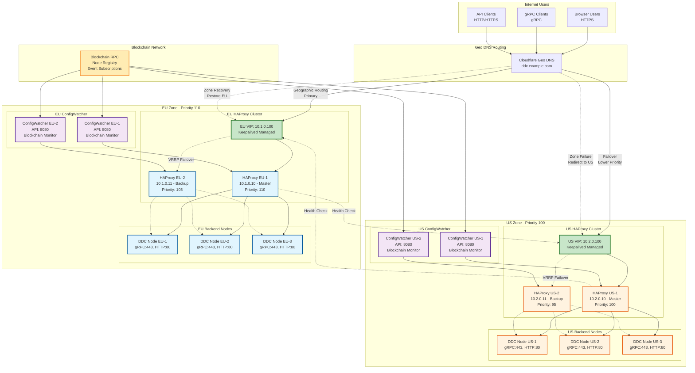

# DDC HAProxy Infrastructure - System Architecture

## Overview

This document describes the system architecture for the DDC (Decentralized Data Cloud) HAProxy Infrastructure, implementing a multi-zone deployment across EU and US regions with high availability, geo-distributed load balancing, and dynamic configuration management.

## System Architecture Diagram

The following diagram shows the complete multi-zone DDC HAProxy infrastructure with all required components as specified in the assignment:



### Diagram Components

The architecture diagram above shows all required components from Assignment Task 1:

✅ **Multi-zone HAProxy deployment (both EU and US zones)**
- EU Zone with Priority 110 (Primary)
- US Zone with Priority 100 (Backup)
- 2-3 HAProxy instances per zone for redundancy

✅ **Keepalived VIP management in each zone**
- EU VIP: 10.1.0.100 managed by Keepalived
- US VIP: 10.2.0.100 managed by Keepalived
- VRRP failover between master and backup instances

✅ **ConfigWatcher service integration points**
- ConfigWatcher API services in both zones
- Integration with HAProxy configuration management
- Real-time configuration updates via API

✅ **Cross-zone failover mechanism**
- VRRP priority-based failover (EU: 110 > US: 100)
- DNS-based zone failover when entire zone fails
- Health monitoring between zones

✅ **Geo DNS routing**
- Cloudflare Geo DNS routing users to nearest zone
- Automatic failover to backup zone on primary zone failure
- Geographic traffic distribution based on user location

## Architecture Principles

### High Availability
- **Multi-Zone Deployment**: Active-Active HAProxy instances across two geographical zones (EU and US)
- **Zone-Level Redundancy**: Each zone operates independently with its own HAProxy cluster
- **Cross-Zone Failover**: Automatic failover between zones when one becomes unavailable
- **VRRP Management**: Keepalived ensures VIP availability within each zone

### Scalability
- **Dynamic Configuration**: ConfigWatcher enables seamless node addition/removal
- **Horizontal Scaling**: Additional HAProxy instances can be added per zone
- **Load Distribution**: Traffic distributed based on geographic proximity and health

### Security
- **TLS Termination**: HTTPS/TLS handling at the HAProxy layer
- **Certificate Management**: Automated SSL certificate provisioning and renewal
- **Secure Communication**: Encrypted communication between all components
- **Access Control**: Authentication and authorization for management interfaces

## Zone Architecture

### EU Zone (Primary - Priority 110)
```
EU Zone Infrastructure:
├── Virtual IP: 10.1.0.100 (Keepalived managed)
├── HAProxy Cluster:
│   ├── HAProxy EU-1 (10.1.0.10) - Master
│   └── HAProxy EU-2 (10.1.0.11) - Backup
├── ConfigWatcher API:
│   ├── ConfigWatcher EU-1 (API: 8080)
│   └── ConfigWatcher EU-2 (API: 8080)
└── Backend Nodes:
    ├── DDC Node EU-1 (gRPC:443, HTTP:80)
    ├── DDC Node EU-2 (gRPC:443, HTTP:80)
    └── DDC Node EU-3 (gRPC:443, HTTP:80)
```

### US Zone (Backup - Priority 100)
```
US Zone Infrastructure:
├── Virtual IP: 10.2.0.100 (Keepalived managed)
├── HAProxy Cluster:
│   ├── HAProxy US-1 (10.2.0.10) - Master
│   └── HAProxy US-2 (10.2.0.11) - Backup
├── ConfigWatcher API:
│   ├── ConfigWatcher US-1 (API: 8080)
│   └── ConfigWatcher US-2 (API: 8080)
└── Backend Nodes:
    ├── DDC Node US-1 (gRPC:443, HTTP:80)
    ├── DDC Node US-2 (gRPC:443, HTTP:80)
    └── DDC Node US-3 (gRPC:443, HTTP:80)
```

## Traffic Flow

### 1. Geo DNS Routing
- **Primary Routing**: Users routed to nearest zone based on geographic location
- **Health-Based Routing**: Unhealthy zones removed from DNS rotation
- **Failover Logic**: Cross-zone failover when primary zone fails

### 2. Zone-Level Load Balancing
- **VIP Management**: Keepalived manages Virtual IP per zone
- **HAProxy Selection**: Traffic directed to active HAProxy instance
- **Backend Distribution**: HAProxy distributes to healthy backend nodes

### 3. Protocol Support
- **HTTPS**: Browser traffic (port 443) → HAProxy → Backend HTTP (port 80)
- **gRPC**: Native gRPC clients (port 443) → HAProxy → Backend gRPC (port 443)
- **HTTP**: REST API clients (port 80) → HAProxy → Backend HTTP (port 80)

## Component Details

### HAProxy Configuration
- **Frontend Configuration**:
  - HTTPS termination with SSL certificates
  - gRPC protocol support with HTTP/2
  - HTTP protocol support
  - Health check endpoints

- **Backend Configuration**:
  - Health checking for backend nodes
  - Load balancing algorithms (roundrobin/leastconn)
  - Connection pooling and timeouts
  - Statistics and monitoring endpoints

### Keepalived (VRRP)
- **VIP Management**: Virtual IP failover within zones
- **Priority Configuration**:
  - EU Zone: Master (110), Backup (105)
  - US Zone: Master (100), Backup (95)
- **Health Monitoring**: HAProxy process monitoring
- **Notification Scripts**: Automated failover notifications

### ConfigWatcher Integration
- **API Interface**: RESTful API for configuration management
- **Blockchain Monitoring**: Monitors DDC node registry
- **Dynamic Updates**: Real-time configuration updates
- **Zero-Downtime Reloads**: Seamless HAProxy configuration reloads

## Failover Scenarios

### Scenario 1: HAProxy Instance Failure
1. Keepalived detects HAProxy failure
2. VIP fails over to backup HAProxy instance
3. Traffic continues without interruption
4. Failed instance replaced/repaired

### Scenario 2: Zone Failure
1. Health checks detect zone unavailability
2. Geo DNS removes failed zone from rotation
3. All traffic redirected to healthy zone
4. Failed zone restored and added back to rotation

### Scenario 3: Backend Node Failure
1. HAProxy health checks detect node failure
2. Failed node removed from load balancing pool
3. Traffic redistributed to healthy nodes
4. ConfigWatcher updates configuration automatically

## Security Architecture

### TLS/SSL Configuration
- **Certificate Management**: Let's Encrypt with auto-renewal
- **Cipher Suites**: Modern, secure cipher configurations
- **HSTS**: HTTP Strict Transport Security enabled
- **Certificate Transparency**: CT log monitoring

### Network Security
- **Firewall Rules**: Strict ingress/egress controls
- **VPN/Private Networks**: Secure inter-zone communication
- **Access Controls**: SSH key-based authentication
- **Network Segmentation**: Isolated management networks

### API Security
- **Authentication**: JWT-based API authentication
- **Authorization**: Role-based access control
- **Rate Limiting**: API request rate limiting
- **Audit Logging**: Comprehensive API access logging

## Monitoring and Observability

### Health Monitoring
- **HAProxy Stats**: Built-in statistics and health endpoints
- **Keepalived Status**: VRRP state monitoring
- **Backend Health**: Continuous backend node health checking
- **Cross-Zone Health**: Inter-zone connectivity monitoring

### Metrics Collection
- **Performance Metrics**: Response times, throughput, error rates
- **Resource Utilization**: CPU, memory, network usage
- **Business Metrics**: Request patterns, geographic distribution
- **Availability Metrics**: Uptime, failover frequency

### Alerting
- **Critical Alerts**: Zone failures, certificate expiry
- **Warning Alerts**: Performance degradation, capacity limits
- **Informational**: Configuration changes, scaling events
- **Escalation**: Multi-tier alert escalation procedures

## Deployment Considerations

### Infrastructure Requirements
- **Minimum Servers**: 4 servers (2 per zone)
- **Recommended**: 6 servers (3 per zone) for full redundancy
- **Network**: Low-latency connections between zones
- **Storage**: Persistent storage for configurations and logs

### Cloud Provider Integration
- **DigitalOcean**: Droplets with floating IPs
- **Hetzner Cloud**: Servers with floating IPs
- **DNS Management**: Cloud provider DNS or external service
- **Load Balancer Integration**: Optional cloud LB for additional redundancy

### Scaling Strategies
- **Horizontal Scaling**: Additional HAProxy instances per zone
- **Vertical Scaling**: Increased server resources
- **Geographic Expansion**: Additional zones (Asia-Pacific, etc.)
- **Backend Scaling**: Dynamic backend node management

## Performance Characteristics

### Expected Performance
- **Throughput**: 10,000+ concurrent connections per HAProxy instance
- **Latency**: <10ms additional latency from load balancing
- **Availability**: 99.99% uptime with proper configuration
- **Failover Time**: <30 seconds for zone failover

### Optimization Areas
- **Connection Pooling**: Efficient backend connection management
- **Caching**: Static content caching at HAProxy level
- **Compression**: Response compression for bandwidth optimization
- **Keep-Alive**: HTTP keep-alive optimization

## Compliance and Standards

### Industry Standards
- **TLS Standards**: TLS 1.2+ compliance
- **HTTP Standards**: HTTP/1.1 and HTTP/2 support
- **gRPC Standards**: Full gRPC protocol compliance
- **Security Standards**: OWASP security guidelines

### Operational Standards
- **Change Management**: Controlled configuration changes
- **Backup Procedures**: Regular configuration backups
- **Disaster Recovery**: Documented recovery procedures
- **Documentation**: Comprehensive operational documentation

## Future Enhancements

### Planned Features
- **Service Mesh Integration**: Istio/Envoy integration
- **Advanced Analytics**: Machine learning-based traffic analysis
- **Edge Computing**: CDN integration for static content
- **Multi-Cloud**: Cross-cloud provider deployment

### Scalability Improvements
- **Auto-Scaling**: Automatic capacity scaling based on load
- **Intelligent Routing**: ML-based traffic routing decisions
- **Global Load Balancing**: Advanced global traffic management
- **Edge Locations**: Additional geographic presence 
